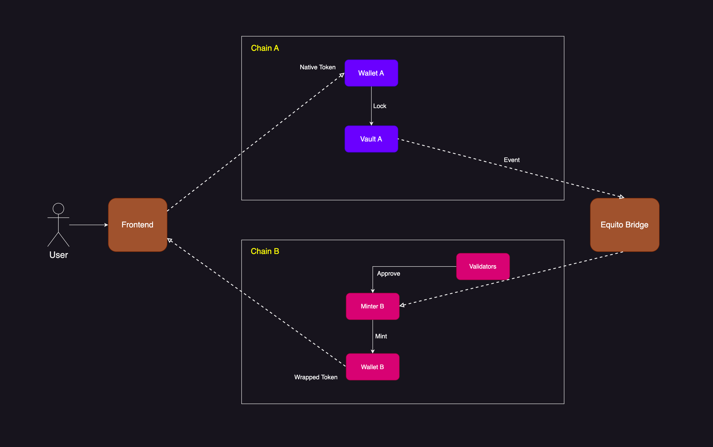
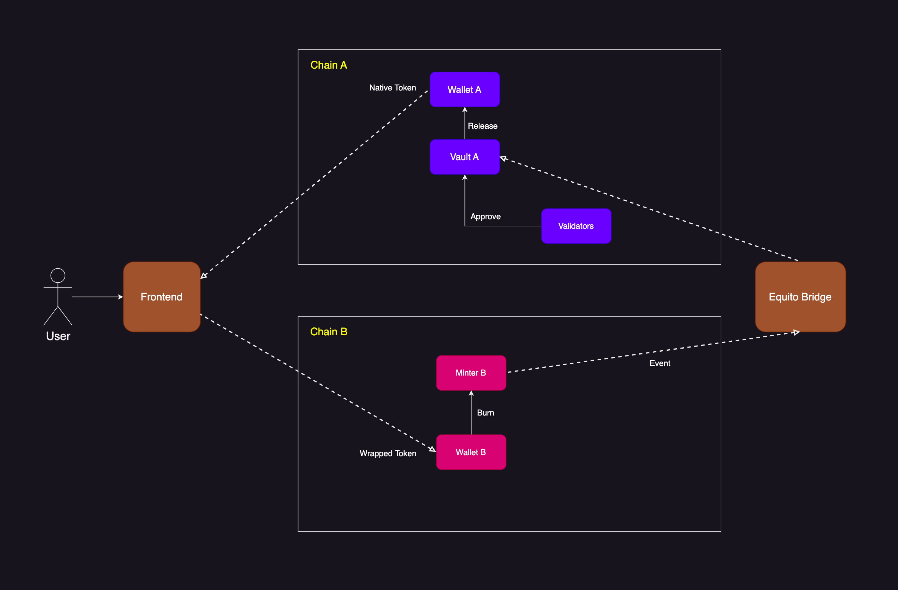

# Equito Bridge Protocol

Equito Bridge is a protocol that facilitates the transfer of assets between layer 1 blockchains in a smooth and seamless manner. The protocol operates using distributed self-approving cross-chain nodes, which host the blockchain network nodes that authenticate transaction requests and operations, ensuring the legitimacy of bridging activity.

Equito Bridge uses a hosted node that verifies token lockup deposits on one chain and mints/unlocks wrapped tokens on the other chain, and vice versa. The local node boasts high performance and bridging networks that allow for fast bridge transactions with a reliable and secure protocol, enhancing overall security.

To achieve cross-chain communication, Equito Bridge sends protocol messages across Algorand to EVM compatible blockchains bidirectionally. The protocol is designed to easily integrate with more blockchain networks to provide robust asset transfer across multiple chains.

The technology powering Equito Bridge enables fast execution of bridging transactions across all bridged networks. However, the speed of asset transfer also depends on the source and destination blockchains' network congestion conditions. If these chains have a high network TPS, the bridging transfer of assets will occur simultaneously. The average time for one bridging session to be successfully completed is currently under 30 seconds.

- Lock and Mint

- Burn and Release

