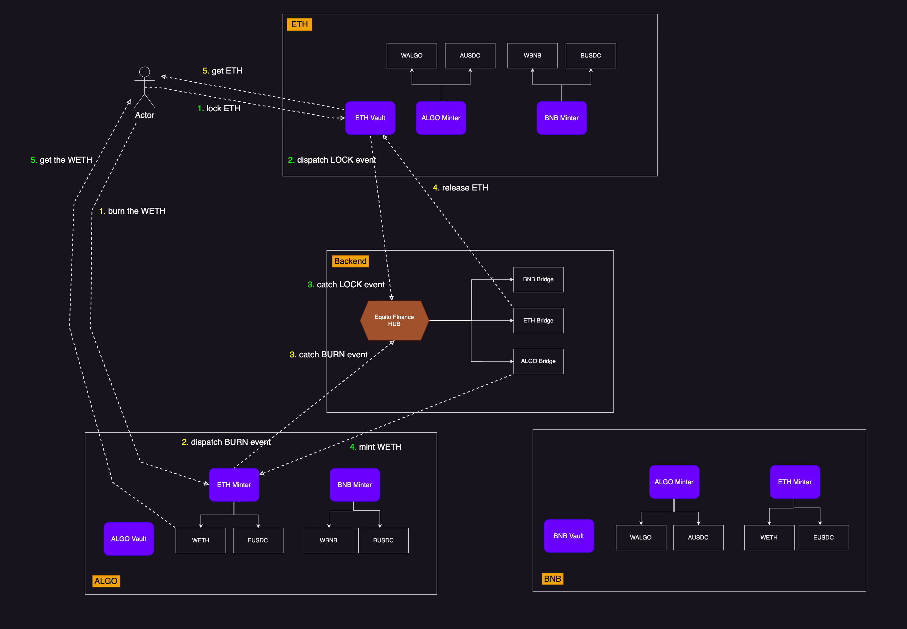

# Detailed steps

Equito bridge facilitates the transfer of assets across two distinct blockchains via Lock, Release, Mint, and Burn contracts deployed on each blockchain. For instance, assume that an Ethereum asset named 'ABC' is sent to the Algorand network. The 'ABC' asset is initially routed to Ethereum's Locking contract, and once the validation process is completed, it is then transferred to the Minting contract on the Algorand Blockchain. Subsequently, a new 'ABC' token is generated in Algorand, corresponding to the Ethereum assets locked, after undergoing verification by a group of validators examining the Minting contract.

Each network within the bridging system is equipped with a singular vault and multiple minter contracts. The purpose of the vault contracts is to facilitate the locking and releasing of original assets, while the minter contracts serve to mint and burn wrapped assets.

The bridging process is executed in two types, as follows:

- Chain A => original asset -> LOCK -> bridging -> MINT -> wrapped asset => Chain B
- Chain B => wrapped asset -> BURN -> bridging -> RELEASE -> original asset => Chain A

To illustrate this process, let us consider the example of ETH -> ALGO bridging, as indicated by the color and numbers of arrowed lines.

The user locks ETH in the Ethereum network, and in return receives WETH (wrapped ETH) in the Algorand network.

1. The user locks ETH to the ETH Vault.
2. The ETH Vault dispatches a LOCK event, which is recorded in the Ethereum transactions.
3. The ALGO bridge captures the LOCK event in the backend and enables the ETH Minter to mint wrapped ETH.
4. The ETH Minter mints WETH to the user.
5. The user receives the WETH (wrapped ETH).

Similarly, for the reverse steps of WETH -> ETH, as indicated by the yellow numbered lines:
The user burns WETH in the Algorand network and receives the original ETH in the Ethereum network.

1. The user burns WETH to the ETH Minter in the Algorand network.
2. The ETH Minter dispatches a BURN event, which is logged in the Algorand transactions.
3. The ETH bridge captures the BURN event in the backend and enables the ETH Vault to release ETH.
4. The ETH Vault releases ETH to the user.
5. The user receives the original ETH.

It is important to note that these steps are applicable to all networks and assets supported by the bridging system, which currently include ALGO, ETH, and BSC, as well as their respective USDC tokens. To ensure security, the bridge employs a multi-signature approach during the transaction process. Further details on this process can be found in the Multi-sig section.
