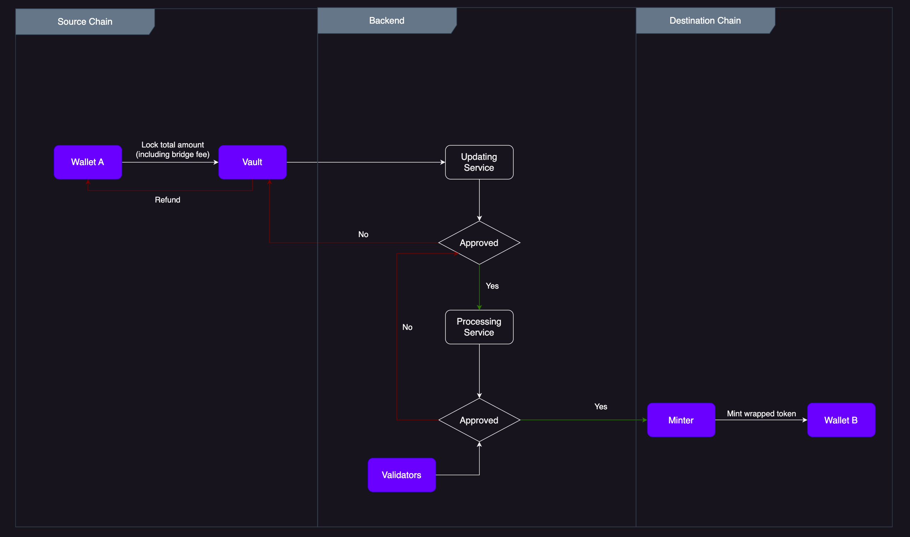

# Lock / Mint

The Equito Bridge gateway protocol enables users to initiate requests on Chain A through interaction with the smart contract. Upon receiving the request call data, the smart contract sends protocol messages to the source blockchain and the local node serves as the validator to ensure the message transmission is valid. The protocol checks whether the native token to be bridged is locked in the contract and then sends an approval message to protocol gateway B.

Through the use of the bridge protocol, assets can be seamlessly transferred across chains using lock and mint smart contract functions. This process involves locking/unlocking the native token on the source chain and minting/burning the wrapped asset on the destination chain.

