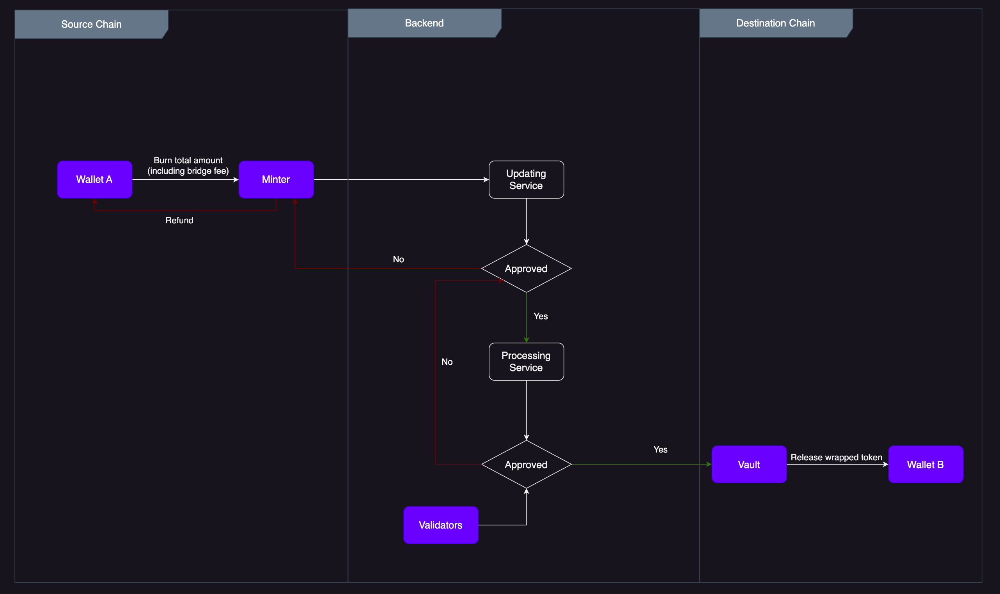

# Burn / Release

The approval message is received by the contract of Chain B, which is then verified by the validator node on the target chain. After verification, the mint contract is initiated to mint wrapped tokens equivalent to the locked asset on the destination chain.
Through Equito Bridge, users can redeem their wrapped tokens for native tokens on the source chain. For this, the smart contract on the destination chain sends a request to unlock the locked asset on the source chain. This request is validated by the validator nodes to ensure that the equivalent amount of wrapped asset and locked collateral exist. Once verified, the same amount of native asset is unlocked on the source chain and the equivalent amount of wrapped asset is burnt, thus permanently removing it from circulation.
To maintain the peg of native assets, Equito Bridge employs the mint and burn smart contract function for wrapping and unwrapping assets. This ensures that wrapped tokens are always pegged to their corresponding native assets.

