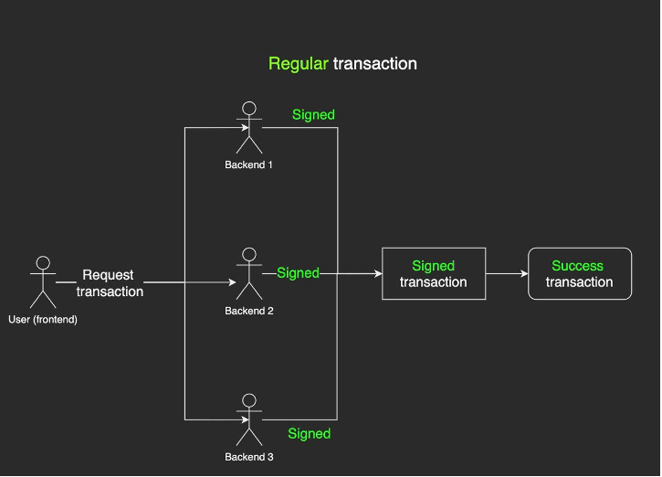
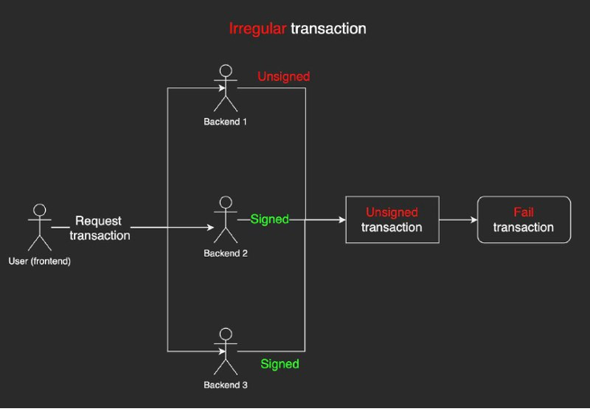

## Bridging Security

# How does the multi-sig work

Multisig, short for multi-signature, is a security feature utilized in various blockchain backends, which requires two or more signatures to be provided before a transaction can be executed. Compared to single-signature transactions, multisig offers enhanced security and reduces the likelihood of unauthorized access to assets.

Equito bridge leverages multisig to secure assets during the transfer process. When bridging assets in the backend, the bridge initiates a multisig transaction that mandates the provision of multiple signatures. This approach offers superior security compared to single-signature transactions. In the event of a backend hack, all assets associated with a single-signature transaction could be lost. However, in the case of multisig, even if one of the servers is compromised, the remaining servers remain secure.

Furthermore, if a hacker attempts to sign a multisig transaction with some of the required keys, the transaction is not executed, thereby ensuring that the bridge remains safe.

Currently, the backend of Equito bridge utilizes three multisig keys, and all bridging transactions require these keys to be signed. This feature enhances the security of the transfer process, as it mandates that multiple parties provide their consent before a transaction is executed.

## Regular transaction

When a user initiates a transaction, it is forwarded to the validators in the backend for processing. Subsequently, the validator signs the transaction and transmits it to the other validators for further processing. Only after the transaction is successfully signed by all validators is it deemed valid and processed.

## Irregular transaction

If a transaction is only signed by some of the validators and not signed by one or more validators, it is considered a failed transaction and will not be processed.
